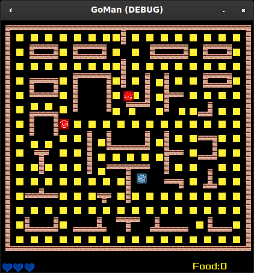

# GoMan
A PacMan clone. Download it [here](https://github.com/thebigG/GoMan/releases)

"Chewing, Breadstick, Single, B.wav" by InspectorJ (www.jshaw.co.uk) of Freesound.org

NOTES:
- The y delta is 24 for most of the food. Same goes for x.
- Need to figure out when enemies are inside certain bounds to know when to make a turn.
